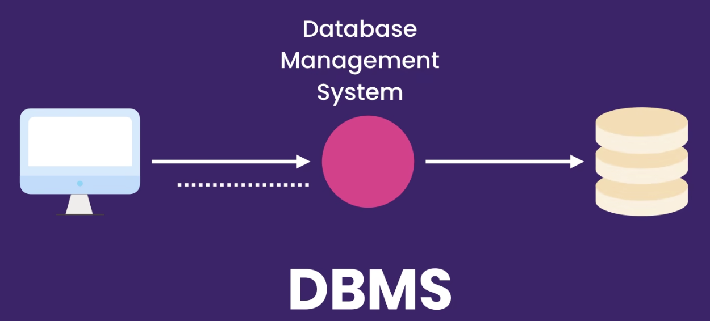

[TOC]

# 数据概要

查看[数据概要](https://zhuanlan.zhihu.com/p/222899373)，大致了解一下课程所用到数据的含义及其相互关系，这对理解课程有极大帮助

# 第一部分：基础--增删查改

## Chapter I. Getting Started

**What is SQL?**

- A DATABASE is a collection of data stored in a format that can easily be accessed
  数据库是一个以易访问格式存储的数据集合
- 为了管理我们的数据库，我们使用一种叫做数据库管理系统（DBMS, Database Management System）的软件。我们连接到一个DBMS然后下达==查询或者修改==数据的指令，DBMS就会执行我们的指令并返回结果

**Database Management System** **(DBMS)**

**DBMS的分类**

1. Relational Databases

   + 把数据存储在**通过某些关系相互关联的数据表中，每张表储存特定的一类数据**，这正是关系型数据库名称的由来。（如：顾客表通过顾客id与订单表相联系，订单表又通过商品id与商品表相联系）

   + SQL（Structured Query Language，结构化查询语言）是专门用来==处理==（包括查询和修改）关系型数据库的标准语言

2. NoSQL

   + 在非关系型数据库中 我们没有表或者相互关系
   + NoSQL systems don't understand SQL (language), 他们有自己的查询语言

**Relational DBMS (RDBMS)**

例如MySQL, SQL Server, Oracle

不同关系型数据库管理系统语法略有不同，但都是基于标准SQL，本课使用最流行的开源关系型数据库管理系统，MySQL

**发音**

没有对错，我倾向于 SQL ('SQUEL') with MySQL (My'SQL')

## Chapter II. Retrieving Data From a Single Table

# 第二部分：基础进阶--汇总、复杂查询、内置函数

# 第三部分：提高效率--视图、存储过程、函数

# 第四部分：高阶主题--触发器、事件、事务、并发

# 第五部分：脱颖而出--数据类型、设计数据库、索引、保护

# Reference

1. [课程官网链接](https://codewithmosh.com/p/complete-sql-mastery[)
2. [b站搬运版本](https://link.zhihu.com/?target=https%3A//www.bilibili.com/video/BV1UE41147KC)
3. [知乎前辈笔记](https://zhuanlan.zhihu.com/p/222865842)